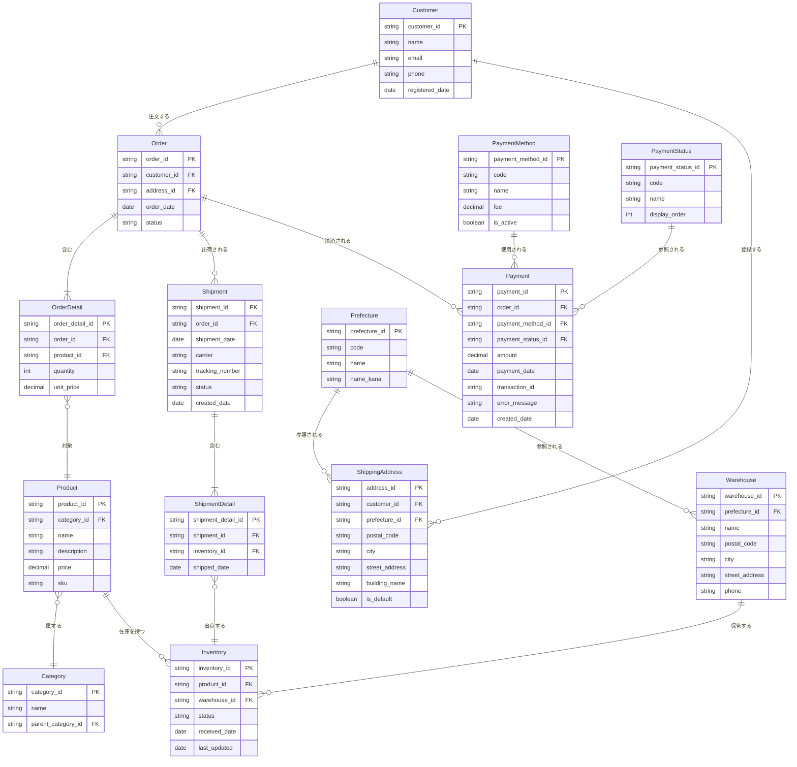

# EC サイトの概念データモデル

## 概要

EC サイトの注文、注文明細、在庫管理を題材にしたデータモデリングのサンプルです。
正規化の学習と実践を目的としています。

## 概念データモデル

以下のエンティティとその関係性を扱います：

## エンティティの説明

### 1. Customer（顧客）

- EC サイトに登録している顧客情報
- 複数の注文を持つことができる（1 対多）

### 2. ShippingAddress（配送先）

- 顧客が登録する配送先住所
- 1 人の顧客が複数の配送先を登録可能（1 対多）
- デフォルト配送先を設定可能
- 都道府県マスタを参照（多対 1）

### 3. Order（注文）

- 顧客が行う注文のヘッダー情報
- 1 つの注文は 1 人の顧客に紐づく（多対 1）
- 1 つの注文は 1 つの配送先を使用（多対 1）
- 1 つの注文は複数の注文明細を持つ（1 対多）
- 1 つの注文は複数の決済レコードを持つ（1 対多）
- 注文合計金額は `SUM(OrderDetail.quantity * OrderDetail.unit_price)` で計算可能なため、保存しない（1 fact 1 place の原則）

### 4. OrderDetail（注文明細）

- 注文に含まれる商品の明細
- 1 つの注文に複数の明細が存在（多対 1）
- 1 つの商品が複数の注文明細に含まれる可能性がある（多対 1）
- 注文時点の単価を保持（商品マスタの価格変更に対応）
- 数量（quantity）と単価（unit_price）を保持
- 小計（subtotal）は `quantity * unit_price` で計算可能なため、保存しない（1 fact 1 place の原則）

### 5. Product（商品）

- 販売する商品のマスタ情報
- 1 つのカテゴリに属する（多対 1）
- 1 つの商品は複数の在庫レコードを持つ（1 対多）
- 在庫 ID は個別の在庫アイテム 1 つ 1 つに振られる

### 6. Category（カテゴリ）

- 商品のカテゴリ分類
- 階層構造をサポート（親カテゴリへの自己参照）

### 7. Prefecture（都道府県）

- 都道府県のマスタ情報
- 都道府県コード、名称、カナ名称を管理
- 複数の配送先から参照される（1 対多）
- 複数の倉庫から参照される（1 対多）

### 8. Warehouse（倉庫）

- 在庫を保管している倉庫のマスタ情報
- 複数の在庫アイテムを保管できる（1 対多）
- 倉庫の所在地情報を管理
- 都道府県マスタを参照（多対 1）

### 9. Inventory（在庫）

- 個別の在庫アイテム 1 つ 1 つを表すレコード
- 1 つの在庫 ID が 1 つの在庫アイテムに対応
- 1 つの商品に対して複数の在庫レコードが存在（1 対多）
- 1 つの倉庫に複数の在庫アイテムが保管される（多対 1）
- 在庫の状態（available/reserved/shipped など）を管理
- 1 つの在庫アイテムは 0 個または 1 個の出荷明細に含まれる（1 対 0 または 1）

### 10. Shipment（出荷）

- 注文に対する出荷情報のヘッダー
- 1 つの注文に対して複数の出荷が発生する可能性がある（分割出荷対応）
- 出荷日、配送会社、追跡番号を管理
- 出荷ステータス（preparing/shipped/delivered など）を管理
- 1 つの出荷は複数の出荷明細を持つ（1 対多）

### 11. ShipmentDetail（出荷明細）

- 出荷に含まれる個別の在庫アイテムを表す
- 1 つの出荷に複数の在庫アイテムが含まれる（多対 1）
- 1 つの在庫アイテムは 0 個または 1 個の出荷明細に含まれる（1 対 0 または 1）
- どの在庫アイテムが出荷されたかを追跡
- 出荷日時を記録

### 12. PaymentMethod（支払い方法マスタ）

- 支払い方法のマスタ情報
- クレジットカード、銀行振込、コンビニ決済、代金引換などを管理
- 各支払い方法の手数料を管理
- 有効/無効フラグで利用可能な支払い方法を制御
- 複数の決済レコードから参照される（1 対多）

### 13. PaymentStatus（支払いステータスマスタ）

- 支払い状況のステータスを管理
- 未払い、支払済み、支払失敗、返金済みなどの状態を管理
- 表示順序を管理
- 複数の決済レコードから参照される（1 対多）

### 14. Payment（決済）

- 注文に対する決済試行の履歴を管理
- 1 つの注文に対して複数の決済試行が存在する可能性がある（1 対多）
- 例：最初の決済が失敗し、2 回目の決済で成功した場合、2 つの決済レコードが作成される
- 1 つの決済は 1 つの支払い方法を使用（多対 1）
- 1 つの決済は 1 つの支払いステータスを持つ（多対 1）
- 決済金額、決済日時、取引 ID、エラーメッセージなどを管理
- 決済試行の履歴を追跡可能

## 検討事項

以下の点について、正規化の過程で検討します：

1. **注文時の価格管理**

   - OrderDetail に unit_price を持たせることで、商品マスタの価格変更の影響を受けない
   - 小計（subtotal）は `quantity * unit_price` で計算可能なため、保存しない（1 fact 1 place の原則に従う）
   - 注文合計金額（total_amount）は `SUM(OrderDetail.quantity * OrderDetail.unit_price)` で計算可能なため、保存しない（1 fact 1 place の原則に従う）
   - これにより、データの冗長性と不整合のリスクを排除

2. **在庫の予約と状態管理**

   - 注文時に在庫を予約する仕組みが必要か
   - Inventory の status で状態を管理するか、別テーブルで予約情報を管理するか
   - 在庫の個別管理により、どの在庫アイテムが予約されているかを追跡可能

3. **カテゴリの階層**

   - 多階層のカテゴリをどう表現するか
   - 現在は parent_category_id で 1 階層のみサポート

4. **注文ステータス**

   - Order の status をどう管理するか（enum 型、別テーブルなど）

5. **出荷と配送情報**

   - Shipment エンティティで出荷情報を管理
   - 分割出荷（1 つの注文が複数の出荷に分かれる）に対応
   - どの在庫アイテムが出荷されたかを ShipmentDetail で追跡

6. **在庫と出荷の関係**

   - 在庫アイテムの状態管理と出荷履歴の整合性
   - 同じ在庫アイテムが複数回出荷されないようにする制約

7. **都道府県マスタの活用**

   - 都道府県情報の正規化により、データの一貫性を保証
   - 配送先と倉庫の都道府県情報を統一管理
   - 都道府県コードによる集計や分析が容易になる

8. **決済情報の管理**
   - Payment エンティティにより、1 つの注文に対する複数の決済試行を管理可能
   - 決済失敗から成功までの履歴を追跡可能
   - PaymentMethod と PaymentStatus により、支払い方法と支払い状況を正規化
   - 支払い方法の追加・変更が容易
   - 支払いステータスの変更履歴を追跡可能
   - 支払い方法ごとの手数料を管理
   - 取引 ID やエラーメッセージにより、決済の詳細な履歴を保持

## 次のステップ

この概念データモデルを基に：

1. 正規化の各段階（第 1 正規形〜第 3 正規形、BCNF）を適用
2. サンプルデータを作成
3. 実際の SQL スキーマに落とし込む
