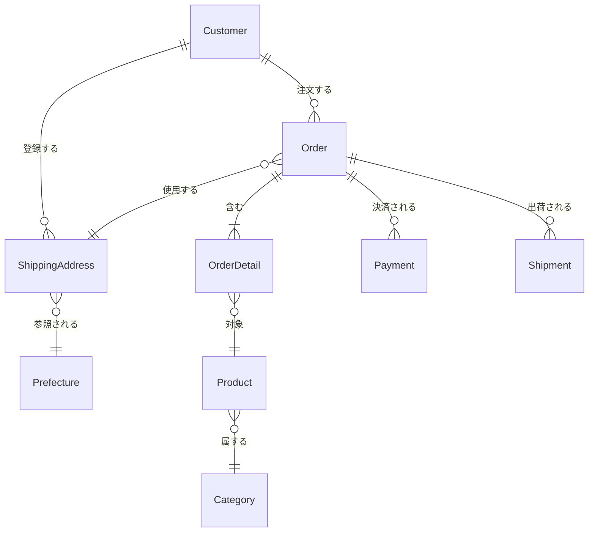

# 正規化の実践：非正規形から正規化されたモデルへ

この資料では、候補 1 の非正規形のサンプルデータを段階的に正規化していく過程を説明します。

## 正規化前の状態（非正規形）

### 現在のデータ構造

すべての情報が 1 つの Order テーブルに集約されています。

**Order テーブル（非正規形）**

| order_id | customer_id | customer_name | customer_email     | customer_phone | address_id | postal_code | prefecture_code | prefecture_name | city       | street_address | order_detail_ids  | product_ids    | product_names          | product_skus         | category_ids         | category_names                 | quantities | unit_prices    | subtotals      | warehouse_ids  | warehouse_names            | warehouse_prefectures | payment_methods                     | payment_statuses | payment_amounts | payment_dates         | transaction_ids              | shipment_date | carrier | tracking_number | order_date | status    | total_amount |
| -------- | ----------- | ------------- | ------------------ | -------------- | ---------- | ----------- | --------------- | --------------- | ---------- | -------------- | ----------------- | -------------- | ---------------------- | -------------------- | -------------------- | ------------------------------ | ---------- | -------------- | -------------- | -------------- | -------------------------- | --------------------- | ----------------------------------- | ---------------- | --------------- | --------------------- | ---------------------------- | ------------- | ------- | --------------- | ---------- | --------- | ------------ |
| ORD001   | C001        | 山田太郎      | yamada@example.com | 090-1234-5678  | ADDR001    | 100-0001    | 13              | 東京都          | 千代田区   | 千代田 1-1-1   | OD001,OD002       | P001,P002      | T シャツ,ジーンズ      | SKU001,SKU002        | CAT001,CAT001        | アパレル,アパレル              | 2,1        | 1500,5000      | 3000,5000      | W001,W002      | 東京倉庫,大阪倉庫          | 東京都,大阪府         | credit_card,credit_card             | failed,paid      | 0,8000          | 2024-01-15,2024-01-16 | TXN001_FAILED,TXN002_SUCCESS | NULL          | NULL    | NULL            | 2024-01-15 | pending   | 8000         |
| ORD002   | C002        | 佐藤花子      | sato@example.com   | 080-9876-5432  | ADDR002    | 530-0001    | 27              | 大阪府          | 大阪市北区 | 梅田 1-1-1     | OD003             | P003           | スニーカー             | SKU003               | CAT002               | シューズ                       | 1          | 8000           | 8000           | W001           | 東京倉庫                   | 東京都                | bank_transfer                       | paid             | 8000            | 2024-01-16            | TXN002                       | 2024-01-17    | yamato  | 1234567890      | 2024-01-16 | confirmed | 8000         |
| ORD003   | C001        | 山田太郎      | yamada@example.com | 090-1234-5678  | ADDR001    | 100-0001    | 13              | 東京都          | 千代田区   | 千代田 1-1-1   | OD004,OD005,OD006 | P001,P004,P005 | T シャツ,パーカー,帽子 | SKU001,SKU004,SKU005 | CAT001,CAT001,CAT003 | アパレル,アパレル,アクセサリー | 3,2,1      | 1500,3000,2000 | 4500,6000,2000 | W001,W001,W001 | 東京倉庫,東京倉庫,東京倉庫 | 東京都,東京都,東京都  | convenience_store,convenience_store | failed,paid      | 0,12500         | 2024-01-17,2024-01-18 | TXN003_FAILED,TXN004_SUCCESS | 2024-01-18    | sagawa  | 9876543210      | 2024-01-17 | shipped   | 12500        |

### 主な問題点

1. **原子性の欠如**: 1 つのセルに複数の値が格納されている（カンマ区切り）
2. **検索・集計・更新が困難**: 文字列操作が必要
3. **極端な冗長性**: 複数のエンティティの情報が 1 テーブルに集約
4. **更新異常**: 顧客情報を更新する際に、複数の注文レコードを更新する必要がある
5. **挿入異常**: 新しい顧客を登録するには、注文を作成する必要がある
6. **削除異常**: 注文を削除すると、顧客情報も失われる可能性がある

---

## 第 1 段階：第 1 正規形（1NF）への変換

### 目的

**原子性の確保**: 1 つのセルには 1 つの値のみを格納する

### 変換方針

1. カンマ区切りの非原子値を分離して、繰り返しグループを別レコードに展開
2. **重要**: この段階では**テーブルを分割せず**、同じ Order テーブル内で繰り返しグループを別レコードに分けるだけ
3. まだ冗長な情報（customer_name, product_name, category_name など）が含まれる。これらは第 2 正規形で分離する。

### 変換後のテーブル構造

#### Order テーブル（第 1 正規形）

カンマ区切りの非原子値を分離し、繰り返しグループを別レコードに展開しました。**商品情報と決済情報は直積（デカルト積）で展開**されます。

**例：ORD001 の場合**

- 商品が 2 つ（OD001-P001, OD002-P002）
- 決済が 2 回（failed, paid）
- → 2 × 2 = 4 レコードに展開

| order_id | customer_id | customer_name | customer_email     | customer_phone | address_id | postal_code | prefecture_code | prefecture_name | city       | street_address | order_detail_id | product_id | product_name | product_sku | category_id | category_name | quantity | unit_price | warehouse_id | warehouse_name | warehouse_prefecture | payment_method    | payment_status | payment_amount | payment_date | transaction_id | shipment_date | carrier | tracking_number | order_date | status    | total_amount |
| -------- | ----------- | ------------- | ------------------ | -------------- | ---------- | ----------- | --------------- | --------------- | ---------- | -------------- | --------------- | ---------- | ------------ | ----------- | ----------- | ------------- | -------- | ---------- | ------------ | -------------- | -------------------- | ----------------- | -------------- | -------------- | ------------ | -------------- | ------------- | ------- | --------------- | ---------- | --------- | ------------ |
| ORD001   | C001        | 山田太郎      | yamada@example.com | 090-1234-5678  | ADDR001    | 100-0001    | 13              | 東京都          | 千代田区   | 千代田 1-1-1   | OD001           | P001       | T シャツ     | SKU001      | CAT001      | アパレル      | 2        | 1500       | W001         | 東京倉庫       | 東京都               | credit_card       | failed         | 0              | 2024-01-15   | TXN001_FAILED  | NULL          | NULL    | NULL            | 2024-01-15 | pending   | 8000         |
| ORD001   | C001        | 山田太郎      | yamada@example.com | 090-1234-5678  | ADDR001    | 100-0001    | 13              | 東京都          | 千代田区   | 千代田 1-1-1   | OD001           | P001       | T シャツ     | SKU001      | CAT001      | アパレル      | 2        | 1500       | W001         | 東京倉庫       | 東京都               | credit_card       | paid           | 8000           | 2024-01-16   | TXN002_SUCCESS | NULL          | NULL    | NULL            | 2024-01-15 | pending   | 8000         |
| ORD001   | C001        | 山田太郎      | yamada@example.com | 090-1234-5678  | ADDR001    | 100-0001    | 13              | 東京都          | 千代田区   | 千代田 1-1-1   | OD002           | P002       | ジーンズ     | SKU002      | CAT001      | アパレル      | 1        | 5000       | W002         | 大阪倉庫       | 大阪府               | credit_card       | failed         | 0              | 2024-01-15   | TXN001_FAILED  | NULL          | NULL    | NULL            | 2024-01-15 | pending   | 8000         |
| ORD001   | C001        | 山田太郎      | yamada@example.com | 090-1234-5678  | ADDR001    | 100-0001    | 13              | 東京都          | 千代田区   | 千代田 1-1-1   | OD002           | P002       | ジーンズ     | SKU002      | CAT001      | アパレル      | 1        | 5000       | W002         | 大阪倉庫       | 大阪府               | credit_card       | paid           | 8000           | 2024-01-16   | TXN002_SUCCESS | NULL          | NULL    | NULL            | 2024-01-15 | pending   | 8000         |
| ORD002   | C002        | 佐藤花子      | sato@example.com   | 080-9876-5432  | ADDR002    | 530-0001    | 27              | 大阪府          | 大阪市北区 | 梅田 1-1-1     | OD003           | P003       | スニーカー   | SKU003      | CAT002      | シューズ      | 1        | 8000       | W001         | 東京倉庫       | 東京都               | bank_transfer     | paid           | 8000           | 2024-01-16   | TXN002         | 2024-01-17    | yamato  | 1234567890      | 2024-01-16 | confirmed | 8000         |
| ORD003   | C001        | 山田太郎      | yamada@example.com | 090-1234-5678  | ADDR001    | 100-0001    | 13              | 東京都          | 千代田区   | 千代田 1-1-1   | OD004           | P001       | T シャツ     | SKU001      | CAT001      | アパレル      | 3        | 1500       | W001         | 東京倉庫       | 東京都               | convenience_store | failed         | 0              | 2024-01-17   | TXN003_FAILED  | NULL          | NULL    | NULL            | 2024-01-17 | shipped   | 12500        |
| ORD003   | C001        | 山田太郎      | yamada@example.com | 090-1234-5678  | ADDR001    | 100-0001    | 13              | 東京都          | 千代田区   | 千代田 1-1-1   | OD004           | P001       | T シャツ     | SKU001      | CAT001      | アパレル      | 3        | 1500       | W001         | 東京倉庫       | 東京都               | convenience_store | paid           | 12500          | 2024-01-18   | TXN004_SUCCESS | 2024-01-18    | sagawa  | 9876543210      | 2024-01-17 | shipped   | 12500        |
| ORD003   | C001        | 山田太郎      | yamada@example.com | 090-1234-5678  | ADDR001    | 100-0001    | 13              | 東京都          | 千代田区   | 千代田 1-1-1   | OD005           | P004       | パーカー     | SKU004      | CAT001      | アパレル      | 2        | 3000       | W001         | 東京倉庫       | 東京都               | convenience_store | failed         | 0              | 2024-01-17   | TXN003_FAILED  | NULL          | NULL    | NULL            | 2024-01-17 | shipped   | 12500        |
| ORD003   | C001        | 山田太郎      | yamada@example.com | 090-1234-5678  | ADDR001    | 100-0001    | 13              | 東京都          | 千代田区   | 千代田 1-1-1   | OD005           | P004       | パーカー     | SKU004      | CAT001      | アパレル      | 2        | 3000       | W001         | 東京倉庫       | 東京都               | convenience_store | paid           | 12500          | 2024-01-18   | TXN004_SUCCESS | 2024-01-18    | sagawa  | 9876543210      | 2024-01-17 | shipped   | 12500        |
| ORD003   | C001        | 山田太郎      | yamada@example.com | 090-1234-5678  | ADDR001    | 100-0001    | 13              | 東京都          | 千代田区   | 千代田 1-1-1   | OD006           | P005       | 帽子         | SKU005      | CAT003      | アクセサリー  | 1        | 2000       | W001         | 東京倉庫       | 東京都               | convenience_store | failed         | 0              | 2024-01-17   | TXN003_FAILED  | NULL          | NULL    | NULL            | 2024-01-17 | shipped   | 12500        |
| ORD003   | C001        | 山田太郎      | yamada@example.com | 090-1234-5678  | ADDR001    | 100-0001    | 13              | 東京都          | 千代田区   | 千代田 1-1-1   | OD006           | P005       | 帽子         | SKU005      | CAT003      | アクセサリー  | 1        | 2000       | W001         | 東京倉庫       | 東京都               | convenience_store | paid           | 12500          | 2024-01-18   | TXN004_SUCCESS | 2024-01-18    | sagawa  | 9876543210      | 2024-01-17 | shipped   | 12500        |

**注意**:

- **直積の展開**: 商品情報と決済情報の組み合わせでレコードが展開される
  - ORD001: 商品 2 つ × 決済 2 回 = 4 レコード
  - ORD002: 商品 1 つ × 決済 1 回 = 1 レコード
  - ORD003: 商品 3 つ × 決済 2 回 = 6 レコード
- 同じ order_id が複数のレコードに分かれている
- まだ冗長な情報が大量に含まれている（customer_name, product_name などが重複）
- この直積展開により、レコード数が大幅に増加する（非効率）

### 第 1 正規形で解決した問題

- ✅ **原子性の確保**: 1 つのセルに 1 つの値のみを格納
- ✅ **検索の改善**: 商品 ID で直接検索可能（`WHERE product_id = 'P001'`）
- ✅ **集計の改善**: 商品ごとの売上を集計可能（`GROUP BY product_id`）

### 第 1 正規形で残っている問題

- ❌ **極端な冗長性**: 同じ order_id のレコードで、customer_name, customer_email, address_id などが重複
- ❌ **部分関数従属**: product_name, product_sku, category_name などが product_id から決定可能
- ❌ **更新異常**: 顧客名を変更する際に、同じ order_id の全レコードを更新する必要がある
- ❌ **挿入異常**: 新しい顧客を登録するには、注文を作成する必要がある
- ❌ **削除異常**: 注文の最後の商品を削除すると、顧客情報も失われる可能性がある
- ❌ **計算可能なフィールド**: total_amount が計算可能

---

## 第 2 段階：第 2 正規形（2NF）への変換

### 目的

**部分関数従属の排除**: 主キーの一部にのみ依存する属性を分離する

### 部分関数従属とは

第 1 正規形の Order テーブルでは、主キーは`(order_id, order_detail_id)`の複合キーになりますが、`customer_name`や`customer_email`などは`customer_id`から決定可能です。つまり、主キーの一部（`customer_id`）にのみ依存する属性が存在します。これが部分関数従属です。

同様に、`product_name`や`category_name`などは`product_id`から決定可能です。

### 変換方針

1. **テーブルの分割**: Order テーブルを複数のテーブルに分割
   - Order テーブル: 注文ヘッダー情報のみ（customer_id, address_id, order_date, status）
   - OrderDetail テーブル: 注文明細情報（order_id, product_id, quantity, unit_price, subtotal）
   - Payment テーブル: 決済情報（order_id, payment_method, payment_status, amount, payment_date, transaction_id）
   - Shipment テーブル: 出荷情報（order_id, shipment_date, carrier, tracking_number）
2. 顧客情報を Customer テーブルに分離（Order テーブルから customer_name, customer_email, customer_phone を削除）
3. 商品情報を Product テーブルに分離（OrderDetail テーブルから product_name, product_sku を削除）
4. 倉庫情報を Warehouse テーブルに分離（OrderDetail テーブルから warehouse_name, warehouse_prefecture を削除）
5. 配送先情報を ShippingAddress テーブルに分離（Order テーブルから配送先情報を削除）
6. 計算可能なフィールド（total_amount）を削除（subtotal は第 2 正規形では残す）
7. **重要**: この段階では**推移的関数従属は残す**。Product テーブルに category_id と category_name の両方が含まれる。これらは第 3 正規形で分離する。

### 変換後のテーブル構造

#### Customer テーブル（新規作成）

| customer_id | name     | email              | phone         |
| ----------- | -------- | ------------------ | ------------- |
| C001        | 山田太郎 | yamada@example.com | 090-1234-5678 |
| C002        | 佐藤花子 | sato@example.com   | 080-9876-5432 |

#### ShippingAddress テーブル（新規作成）

| address_id | customer_id | postal_code | prefecture_code | prefecture_name | city       | street_address |
| ---------- | ----------- | ----------- | --------------- | --------------- | ---------- | -------------- |
| ADDR001    | C001        | 100-0001    | 13              | 東京都          | 千代田区   | 千代田 1-1-1   |
| ADDR002    | C002        | 530-0001    | 27              | 大阪府          | 大阪市北区 | 梅田 1-1-1     |

**注意**: prefecture_name は prefecture_code から決定可能だが、第 2 正規形ではまだ含まれている（推移的関数従属）。第 3 正規形で分離する。

#### Product テーブル（新規作成）

| product_id | category_id | category_name | name       | sku    | price |
| ---------- | ----------- | ------------- | ---------- | ------ | ----- |
| P001       | CAT001      | アパレル      | T シャツ   | SKU001 | 1500  |
| P002       | CAT001      | アパレル      | ジーンズ   | SKU002 | 5000  |
| P003       | CAT002      | シューズ      | スニーカー | SKU003 | 8000  |
| P004       | CAT001      | アパレル      | パーカー   | SKU004 | 3000  |
| P005       | CAT003      | アクセサリー  | 帽子       | SKU005 | 2000  |

**注意**: category_name は category_id から決定可能だが、第 2 正規形ではまだ含まれている（推移的関数従属）。第 3 正規形で Category テーブルに分離する。

#### Warehouse テーブル（新規作成）

| warehouse_id | prefecture_code | prefecture_name | name     |
| ------------ | --------------- | --------------- | -------- |
| W001         | 13              | 東京都          | 東京倉庫 |
| W002         | 27              | 大阪府          | 大阪倉庫 |

**注意**: prefecture_name は prefecture_code から決定可能だが、第 2 正規形ではまだ含まれている（推移的関数従属）。第 3 正規形で分離する。

#### Order テーブル（第 2 正規形）

| order_id | customer_id | address_id | order_date | status    |
| -------- | ----------- | ---------- | ---------- | --------- |
| ORD001   | C001        | ADDR001    | 2024-01-15 | pending   |
| ORD002   | C002        | ADDR002    | 2024-01-16 | confirmed |
| ORD003   | C001        | ADDR001    | 2024-01-17 | shipped   |

#### OrderDetail テーブル（第 2 正規形）

| order_detail_id | order_id | product_id | quantity | unit_price | subtotal |
| --------------- | -------- | ---------- | -------- | ---------- | -------- |
| OD001           | ORD001   | P001       | 2        | 1500       | 3000     |
| OD002           | ORD001   | P002       | 1        | 5000       | 5000     |
| OD003           | ORD002   | P003       | 1        | 8000       | 8000     |
| OD004           | ORD003   | P001       | 3        | 1500       | 4500     |
| OD005           | ORD003   | P004       | 2        | 3000       | 6000     |
| OD006           | ORD003   | P005       | 1        | 2000       | 2000     |

**注意**: subtotal は`quantity * unit_price`で計算可能だが、第 2 正規形では残している。これは「1 fact 1 place」の原則に従うべきだが、第 2 正規化の目的（部分関数従属の排除）とは別の観点である。

#### Payment テーブル（新規作成）

第 1 正規形で直積展開されていた決済情報を、独立したテーブルに分離しました。

| payment_id | order_id | payment_method    | payment_status | amount | payment_date | transaction_id |
| ---------- | -------- | ----------------- | -------------- | ------ | ------------ | -------------- |
| PAY001     | ORD001   | credit_card       | failed         | 0      | 2024-01-15   | TXN001_FAILED  |
| PAY002     | ORD001   | credit_card       | paid           | 8000   | 2024-01-16   | TXN002_SUCCESS |
| PAY003     | ORD002   | bank_transfer     | paid           | 8000   | 2024-01-16   | TXN002         |
| PAY004     | ORD003   | convenience_store | failed         | 0      | 2024-01-17   | TXN003_FAILED  |
| PAY005     | ORD003   | convenience_store | paid           | 12500  | 2024-01-18   | TXN004_SUCCESS |

#### Shipment テーブル（新規作成）

第 1 正規形で直積展開されていた出荷情報を、独立したテーブルに分離しました。

| shipment_id | order_id | shipment_date | carrier | tracking_number |
| ----------- | -------- | ------------- | ------- | --------------- |
| SHIP001     | ORD002   | 2024-01-17    | yamato  | 1234567890      |
| SHIP002     | ORD003   | 2024-01-18    | sagawa  | 9876543210      |

### 第 2 正規形で解決した問題

- ✅ **部分関数従属の排除**: 主キーの一部にのみ依存する属性を分離
- ✅ **冗長性の削減**: 顧客情報、商品情報の重複を排除
- ✅ **更新異常の改善**: 商品名を変更する際に、Product テーブルの 1 レコードのみを更新
- ✅ **挿入異常の改善**: 新しい顧客を登録する際に、Customer テーブルに直接挿入可能
- ✅ **削除異常の改善**: 注文を削除しても、顧客情報は Customer テーブルに残る

### 第 2 正規形で残っている問題

- ❌ **推移的関数従属**:
  - Product テーブルに category_name が含まれている（category_id → category_name）
  - ShippingAddress テーブルに prefecture_name が含まれている（prefecture_code → prefecture_name）
  - Warehouse テーブルに prefecture_name が含まれている（prefecture_code → prefecture_name）
- ❌ **計算可能なフィールド**: OrderDetail テーブルに subtotal が残っている（quantity \* unit_price で計算可能）

---

## 第 3 段階：第 3 正規形（3NF）への変換

### 目的

**推移的関数従属の排除**: 非キー属性間の依存関係を排除する

### 推移的関数従属とは

第 2 正規形では、主キーへの完全関数従属は解決されましたが、非キー属性間の依存関係が残っています。

**例：Product テーブル**

- `product_id`（主キー）→ `category_id`（非キー属性）
- `category_id`（非キー属性）→ `category_name`（非キー属性）

このように、主キーを経由せずに非キー属性から別の非キー属性が決定される関係を**推移的関数従属**と呼びます。

**問題点**:

- カテゴリ名を変更する際に、Product テーブルの複数のレコードを更新する必要がある
- カテゴリ情報が Product テーブルに重複して保存される

### 変換方針

1. **Category テーブルを作成**し、カテゴリ情報を分離
2. Product テーブルから category_name を削除し、category_id のみを保持
3. **Prefecture テーブルを作成**し、都道府県情報を分離
4. ShippingAddress と Warehouse から prefecture_name を削除し、prefecture_id のみを保持
5. **計算可能なフィールドの削除**: OrderDetail テーブルから subtotal を削除（quantity \* unit_price で計算可能なため）

### 変換後のテーブル構造

#### Category テーブル（新規作成）

| category_id | name         |
| ----------- | ------------ |
| CAT001      | アパレル     |
| CAT002      | シューズ     |
| CAT003      | アクセサリー |

#### Product テーブル（第 3 正規形）

| product_id | category_id | name       | sku    | price |
| ---------- | ----------- | ---------- | ------ | ----- |
| P001       | CAT001      | T シャツ   | SKU001 | 1500  |
| P002       | CAT001      | ジーンズ   | SKU002 | 5000  |
| P003       | CAT002      | スニーカー | SKU003 | 8000  |
| P004       | CAT001      | パーカー   | SKU004 | 3000  |
| P005       | CAT003      | 帽子       | SKU005 | 2000  |

**変更点**: category_name を削除し、category_id のみを保持。category_name は Category テーブルから取得する。

#### Prefecture テーブル（新規作成）

| prefecture_id | code | name   | name_kana    |
| ------------- | ---- | ------ | ------------ |
| PREF001       | 13   | 東京都 | トウキョウト |
| PREF002       | 27   | 大阪府 | オオサカフ   |

#### ShippingAddress テーブル（第 3 正規形）

| address_id | customer_id | prefecture_id | postal_code | city       | street_address |
| ---------- | ----------- | ------------- | ----------- | ---------- | -------------- |
| ADDR001    | C001        | PREF001       | 100-0001    | 千代田区   | 千代田 1-1-1   |
| ADDR002    | C002        | PREF002       | 530-0001    | 大阪市北区 | 梅田 1-1-1     |

**変更点**:

- 第 2 正規形では `prefecture_code` と `prefecture_name` の両方が含まれていた
- 第 3 正規形では `prefecture_name` を削除し、`prefecture_id` のみを保持
- `prefecture_name` は Prefecture テーブルから取得する

#### Warehouse テーブル（第 3 正規形）

| warehouse_id | prefecture_id | name     |
| ------------ | ------------- | -------- |
| W001         | PREF001       | 東京倉庫 |
| W002         | PREF002       | 大阪倉庫 |

**変更点**:

- 第 2 正規形では `prefecture_code` と `prefecture_name` の両方が含まれていた
- 第 3 正規形では `prefecture_name` を削除し、`prefecture_id` のみを保持
- `prefecture_name` は Prefecture テーブルから取得する

#### OrderDetail テーブル（第 3 正規形）

| order_detail_id | order_id | product_id | quantity | unit_price |
| --------------- | -------- | ---------- | -------- | ---------- |
| OD001           | ORD001   | P001       | 2        | 1500       |
| OD002           | ORD001   | P002       | 1        | 5000       |
| OD003           | ORD002   | P003       | 1        | 8000       |
| OD004           | ORD003   | P001       | 3        | 1500       |
| OD005           | ORD003   | P004       | 2        | 3000       |
| OD006           | ORD003   | P005       | 1        | 2000       |

**変更点**:

- 第 2 正規形では `subtotal` が含まれていた
- 第 3 正規形では `subtotal` を削除（`quantity * unit_price` で計算可能なため）
- 「1 fact 1 place」の原則に従い、計算可能な値は保存しない

### 第 3 正規形で解決した問題

- ✅ **推移的関数従属の排除**:
  - Product → category_id → Category.name の依存関係を明確化（Category テーブルを作成）
  - ShippingAddress → prefecture_id → Prefecture.name の依存関係を明確化（Prefecture テーブルを作成）
  - Warehouse → prefecture_id → Prefecture.name の依存関係を明確化（Prefecture テーブルを作成）
- ✅ **更新異常の改善**:
  - カテゴリ名を変更する際に、Category テーブルの 1 レコードのみを更新（Product テーブルの複数レコードを更新する必要がない）
  - 都道府県名を変更する際に、Prefecture テーブルの 1 レコードのみを更新（ShippingAddress や Warehouse テーブルの複数レコードを更新する必要がない）
- ✅ **冗長性のさらなる削減**: カテゴリ情報や都道府県情報の重複を完全に排除
- ✅ **挿入異常の改善**: 新しいカテゴリを登録する際に、Category テーブルに直接挿入可能（商品が存在しなくても登録可能）
- ✅ **削除異常の改善**: 商品を削除しても、カテゴリ情報は Category テーブルに残る
- ✅ **計算可能なフィールドの削除**: OrderDetail テーブルから subtotal を削除し、「1 fact 1 place」の原則に従う

---

## 最終的な正規化されたモデル

### エンティティ関係図

### 最終的なテーブル一覧

1. **Customer** - 顧客情報
2. **ShippingAddress** - 配送先情報
3. **Prefecture** - 都道府県マスタ
4. **Order** - 注文ヘッダー
5. **OrderDetail** - 注文明細
6. **Product** - 商品マスタ
7. **Category** - カテゴリマスタ
8. **Payment** - 決済情報
9. **Shipment** - 出荷情報

### 正規化の効果

#### 解決した問題

- ✅ **原子性の確保**: 1 つのセルに 1 つの値のみを格納
- ✅ **冗長性の削減**: データの重複を排除
- ✅ **更新異常の解消**: 1 箇所の更新で済む
- ✅ **挿入異常の解消**: 独立してエンティティを登録可能
- ✅ **削除異常の解消**: 関連データを失うことなく削除可能
- ✅ **検索・集計の改善**: SQL で直接操作可能

#### 正規化のメリット

1. **保守性の向上**: 変更時の影響範囲が明確
2. **拡張性の向上**: 新しいエンティティを追加しやすい
3. **パフォーマンス**: 適切なインデックス設定が可能
4. **データ整合性**: 外部キー制約による整合性保証

---

## まとめ

非正規形から正規化されたモデルへの変換により、以下の改善が実現されました：

1. **第 1 正規形**: 原子性の確保により、検索・集計が容易に
2. **第 2 正規形**: 冗長性の削減により、更新異常を解消
3. **第 3 正規形**: 推移的関数従属の排除により、さらに冗長性を削減

正規化により、データベースの品質が大幅に向上し、保守性・拡張性・パフォーマンスが改善されました。
