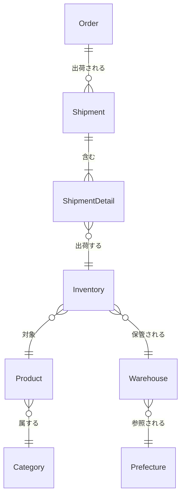

# 正規化の実践：出荷・在庫管理の非正規形から正規化されたモデルへ

この資料では、出荷（Shipment）と在庫（Inventory）管理に関する非正規形のサンプルデータを段階的に正規化していく過程を説明します。

## 正規化前の状態（非正規形）

### 現在のデータ構造

すべての情報が 1 つの Shipment テーブルに集約されています。

**Shipment テーブル（非正規形）**

| shipment_id | order_id | order_detail_ids | shipment_date | carrier | tracking_number | status      | created_date | shipment_detail_ids | inventory_ids    | product_ids    | product_names          | product_skus         | category_ids         | category_names                 | warehouse_ids  | warehouse_names            | warehouse_prefectures | inventory_statuses        | received_dates         | last_updated_dates        | shipped_dates          |
| ----------- | -------- | ---------------- | ------------- | ------- | --------------- | ---------- | ------------ | ------------------- | ---------------- | -------------- | ---------------------- | -------------------- | -------------------- | ------------------------------ | -------------- | -------------------------- | --------------------- | ------------------------- | ---------------------- | ------------------------- | ---------------------- |
| SHIP001     | ORD001   | OD001,OD002      | 2024-01-17    | yamato  | 1234567890      | shipped    | 2024-01-17   | SD001,SD002         | INV001,INV002     | P001,P002      | T シャツ,ジーンズ      | SKU001,SKU002        | CAT001,CAT001        | アパレル,アパレル              | W001,W002      | 東京倉庫,大阪倉庫          | 東京都,大阪府         | available,available      | 2024-01-10,2024-01-12 | 2024-01-15,2024-01-16   | 2024-01-17,2024-01-17 |
| SHIP002     | ORD002   | OD003             | 2024-01-18    | sagawa  | 9876543210      | shipped    | 2024-01-18   | SD003               | INV003           | P003           | スニーカー             | SKU003               | CAT002               | シューズ                       | W001           | 東京倉庫                   | 東京都                | available                | 2024-01-11            | 2024-01-17               | 2024-01-18            |
| SHIP003     | ORD003   | OD004,OD005,OD006 | 2024-01-19    | yamato  | 1111111111      | preparing  | 2024-01-19   | SD004,SD005,SD006   | INV004,INV005,INV006 | P001,P004,P005 | T シャツ,パーカー,帽子 | SKU001,SKU004,SKU005 | CAT001,CAT001,CAT003 | アパレル,アパレル,アクセサリー | W001,W001,W001 | 東京倉庫,東京倉庫,東京倉庫 | 東京都,東京都,東京都  | reserved,reserved,reserved | 2024-01-08,2024-01-09,2024-01-10 | 2024-01-18,2024-01-18,2024-01-18 | NULL,NULL,NULL |

### 主な問題点

1. **原子性の欠如**: 1 つのセルに複数の値が格納されている（カンマ区切り）
2. **検索・集計・更新が困難**: 文字列操作が必要
3. **極端な冗長性**: 複数のエンティティの情報が 1 テーブルに集約
4. **更新異常**: 商品情報を更新する際に、複数の出荷レコードを更新する必要がある
5. **挿入異常**: 新しい在庫を登録するには、出荷を作成する必要がある
6. **削除異常**: 出荷を削除すると、在庫情報も失われる可能性がある

---

## 第 1 段階：第 1 正規形（1NF）への変換

### 目的

**原子性の確保**: 1 つのセルには 1 つの値のみを格納する

### 変換方針

1. カンマ区切りの非原子値を分離して、繰り返しグループを別レコードに展開
2. **重要**: この段階では**テーブルを分割せず**、同じ Shipment テーブル内で繰り返しグループを別レコードに分けるだけ
3. まだ冗長な情報（product_name, warehouse_name, category_name など）が含まれる。これらは第 2 正規形で分離する。

### 変換後のテーブル構造

#### Shipment テーブル（第 1 正規形）

カンマ区切りの非原子値を分離し、繰り返しグループを別レコードに展開しました。**出荷明細情報と在庫情報は直積（デカルト積）で展開**されます。

**例：SHIP001 の場合**

- 出荷明細が 2 つ（SD001-INV001, SD002-INV002）
- → 2 レコードに展開

| shipment_id | order_id | order_detail_id | shipment_date | carrier | tracking_number | status   | created_date | shipment_detail_id | inventory_id | product_id | product_name | product_sku | category_id | category_name | warehouse_id | warehouse_name | warehouse_prefecture | inventory_status | received_date | last_updated_date | shipped_date |
| ----------- | -------- | --------------- | ------------- | ------- | --------------- | -------- | ------------ | ------------------ | ------------ | ---------- | ------------ | ----------- | ----------- | ------------- | ------------ | -------------- | ------------------- | ---------------- | ------------- | ----------------- | ------------ |
| SHIP001     | ORD001   | OD001           | 2024-01-17    | yamato  | 1234567890      | shipped  | 2024-01-17   | SD001              | INV001       | P001       | T シャツ     | SKU001      | CAT001      | アパレル      | W001         | 東京倉庫       | 東京都               | available        | 2024-01-10    | 2024-01-15        | 2024-01-17   |
| SHIP001     | ORD001   | OD002           | 2024-01-17    | yamato  | 1234567890      | shipped  | 2024-01-17   | SD002              | INV002       | P002       | ジーンズ     | SKU002      | CAT001      | アパレル      | W002         | 大阪倉庫       | 大阪府               | available        | 2024-01-12    | 2024-01-16        | 2024-01-17   |
| SHIP002     | ORD002   | OD003           | 2024-01-18    | sagawa  | 9876543210      | shipped  | 2024-01-18   | SD003              | INV003       | P003       | スニーカー   | SKU003      | CAT002      | シューズ      | W001         | 東京倉庫       | 東京都               | available        | 2024-01-11    | 2024-01-17        | 2024-01-18   |
| SHIP003     | ORD003   | OD004           | 2024-01-19    | yamato  | 1111111111      | preparing | 2024-01-19   | SD004              | INV004       | P001       | T シャツ     | SKU001      | CAT001      | アパレル      | W001         | 東京倉庫       | 東京都               | reserved         | 2024-01-08    | 2024-01-18        | NULL         |
| SHIP003     | ORD003   | OD005           | 2024-01-19    | yamato  | 1111111111      | preparing | 2024-01-19   | SD005              | INV005       | P004       | パーカー     | SKU004      | CAT001      | アパレル      | W001         | 東京倉庫       | 東京都               | reserved         | 2024-01-09    | 2024-01-18        | NULL         |
| SHIP003     | ORD003   | OD006           | 2024-01-19    | yamato  | 1111111111      | preparing | 2024-01-19   | SD006              | INV006       | P005       | 帽子         | SKU005      | CAT003      | アクセサリー  | W001         | 東京倉庫       | 東京都               | reserved         | 2024-01-10    | 2024-01-18        | NULL         |

**注意**:

- **直積の展開**: 出荷明細情報が別レコードに展開される
  - SHIP001: 出荷明細 2 つ = 2 レコード
  - SHIP002: 出荷明細 1 つ = 1 レコード
  - SHIP003: 出荷明細 3 つ = 3 レコード
- 同じ shipment_id が複数のレコードに分かれている
- まだ冗長な情報が大量に含まれている（product_name, warehouse_name などが重複）
- この直積展開により、レコード数が増加する（非効率）

### 第 1 正規形で解決した問題

- ✅ **原子性の確保**: 1 つのセルに 1 つの値のみを格納
- ✅ **検索の改善**: 在庫 ID で直接検索可能（`WHERE inventory_id = 'INV001'`）
- ✅ **集計の改善**: 商品ごとの出荷数を集計可能（`GROUP BY product_id`）

### 第 1 正規形で残っている問題

- ❌ **極端な冗長性**: 同じ shipment_id のレコードで、shipment_date, carrier, tracking_number などが重複
- ❌ **部分関数従属**: product_name, product_sku, category_name などが product_id から決定可能
- ❌ **更新異常**: 商品名を変更する際に、同じ shipment_id の全レコードを更新する必要がある
- ❌ **挿入異常**: 新しい在庫を登録するには、出荷を作成する必要がある
- ❌ **削除異常**: 出荷の最後の明細を削除すると、在庫情報も失われる可能性がある

---

## 第 2 段階：第 2 正規形（2NF）への変換

### 目的

**部分関数従属の排除**: 主キーの一部にのみ依存する属性を分離する

### 部分関数従属とは

第 1 正規形の Shipment テーブルでは、主キーは`(shipment_id, shipment_detail_id)`の複合キーになりますが、`shipment_date`や`carrier`などは`shipment_id`から決定可能です。つまり、主キーの一部（`shipment_id`）にのみ依存する属性が存在します。これが部分関数従属です。

同様に、`product_name`や`category_name`などは`product_id`から決定可能です。

### 変換方針

1. **テーブルの分割**: Shipment テーブルを複数のテーブルに分割
   - Shipment テーブル: 出荷ヘッダー情報のみ（order_id, shipment_date, carrier, tracking_number, status, created_date）
   - ShipmentDetail テーブル: 出荷明細情報（shipment_id, inventory_id, shipped_date）
   - Inventory テーブル: 在庫情報（inventory_id, product_id, warehouse_id, status, received_date, last_updated）
2. 商品情報を Product テーブルに分離（Inventory テーブルから product_name, product_sku を削除）
3. 倉庫情報を Warehouse テーブルに分離（Inventory テーブルから warehouse_name, warehouse_prefecture を削除）
4. **重要**: この段階では**推移的関数従属は残す**。Product テーブルに category_id と category_name の両方が含まれる。これらは第 3 正規形で分離する。

### 変換後のテーブル構造

#### Product テーブル（新規作成）

| product_id | category_id | category_name | name       | sku    | price |
| ---------- | ----------- | ------------- | ---------- | ------ | ----- |
| P001       | CAT001      | アパレル      | T シャツ   | SKU001 | 1500  |
| P002       | CAT001      | アパレル      | ジーンズ   | SKU002 | 5000  |
| P003       | CAT002      | シューズ      | スニーカー | SKU003 | 8000  |
| P004       | CAT001      | アパレル      | パーカー   | SKU004 | 3000  |
| P005       | CAT003      | アクセサリー  | 帽子       | SKU005 | 2000  |

**注意**: category_name は category_id から決定可能だが、第 2 正規形ではまだ含まれている（推移的関数従属）。第 3 正規形で Category テーブルに分離する。

#### Warehouse テーブル（新規作成）

| warehouse_id | prefecture_code | prefecture_name | name     |
| ------------ | --------------- | --------------- | -------- |
| W001         | 13              | 東京都          | 東京倉庫 |
| W002         | 27              | 大阪府          | 大阪倉庫 |

**注意**: prefecture_name は prefecture_code から決定可能だが、第 2 正規形ではまだ含まれている（推移的関数従属）。第 3 正規形で分離する。

#### Shipment テーブル（第 2 正規形）

| shipment_id | order_id | shipment_date | carrier | tracking_number | status    | created_date |
| ----------- | -------- | ------------- | ------- | --------------- | --------- | ------------ |
| SHIP001     | ORD001   | 2024-01-17    | yamato  | 1234567890      | shipped   | 2024-01-17   |
| SHIP002     | ORD002   | 2024-01-18    | sagawa  | 9876543210      | shipped   | 2024-01-18   |
| SHIP003     | ORD003   | 2024-01-19    | yamato  | 1111111111      | preparing | 2024-01-19   |

#### ShipmentDetail テーブル（新規作成）

第 1 正規形で直積展開されていた出荷明細情報を、独立したテーブルに分離しました。

| shipment_detail_id | shipment_id | inventory_id | shipped_date |
| ------------------ | ----------- | ------------ | ------------ |
| SD001              | SHIP001     | INV001       | 2024-01-17   |
| SD002              | SHIP001     | INV002       | 2024-01-17   |
| SD003              | SHIP002     | INV003       | 2024-01-18   |
| SD004              | SHIP003     | INV004       | NULL         |
| SD005              | SHIP003     | INV005       | NULL         |
| SD006              | SHIP003     | INV006       | NULL         |

#### Inventory テーブル（新規作成）

| inventory_id | product_id | warehouse_id | status    | received_date | last_updated_date |
| ------------ | ---------- | ------------ | --------- | ------------- | ----------------- |
| INV001       | P001       | W001         | available | 2024-01-10    | 2024-01-15       |
| INV002       | P002       | W002         | available | 2024-01-12    | 2024-01-16       |
| INV003       | P003       | W001         | available | 2024-01-11    | 2024-01-17       |
| INV004       | P001       | W001         | reserved  | 2024-01-08    | 2024-01-18       |
| INV005       | P004       | W001         | reserved  | 2024-01-09    | 2024-01-18       |
| INV006       | P005       | W001         | reserved  | 2024-01-10    | 2024-01-18       |

### 第 2 正規形で解決した問題

- ✅ **部分関数従属の排除**: 主キーの一部にのみ依存する属性を分離
- ✅ **冗長性の削減**: 商品情報、倉庫情報の重複を排除
- ✅ **更新異常の改善**: 商品名を変更する際に、Product テーブルの 1 レコードのみを更新
- ✅ **挿入異常の改善**: 新しい在庫を登録する際に、Inventory テーブルに直接挿入可能
- ✅ **削除異常の改善**: 出荷を削除しても、在庫情報は Inventory テーブルに残る

### 第 2 正規形で残っている問題

- ❌ **推移的関数従属**:
  - Product テーブルに category_name が含まれている（category_id → category_name）
  - Warehouse テーブルに prefecture_name が含まれている（prefecture_code → prefecture_name）

---

## 第 3 段階：第 3 正規形（3NF）への変換

### 目的

**推移的関数従属の排除**: 非キー属性間の依存関係を排除する

### 推移的関数従属とは

第 2 正規形では、主キーへの完全関数従属は解決されましたが、非キー属性間の依存関係が残っています。

**例：Product テーブル**

- `product_id`（主キー）→ `category_id`（非キー属性）
- `category_id`（非キー属性）→ `category_name`（非キー属性）

このように、主キーを経由せずに非キー属性から別の非キー属性が決定される関係を**推移的関数従属**と呼びます。

**問題点**:

- カテゴリ名を変更する際に、Product テーブルの複数のレコードを更新する必要がある
- カテゴリ情報が Product テーブルに重複して保存される

### 変換方針

1. **Category テーブルを作成**し、カテゴリ情報を分離
2. Product テーブルから category_name を削除し、category_id のみを保持
3. **Prefecture テーブルを作成**し、都道府県情報を分離
4. Warehouse から prefecture_name を削除し、prefecture_id のみを保持

### 変換後のテーブル構造

#### Category テーブル（新規作成）

| category_id | name         |
| ---------- | ------------ |
| CAT001     | アパレル     |
| CAT002     | シューズ     |
| CAT003     | アクセサリー |

#### Product テーブル（第 3 正規形）

| product_id | category_id | name       | sku    | price |
| ---------- | ----------- | ---------- | ------ | ----- |
| P001       | CAT001      | T シャツ   | SKU001 | 1500  |
| P002       | CAT001      | ジーンズ   | SKU002 | 5000  |
| P003       | CAT002      | スニーカー | SKU003 | 8000  |
| P004       | CAT001      | パーカー   | SKU004 | 3000  |
| P005       | CAT003      | 帽子       | SKU005 | 2000  |

**変更点**: category_name を削除し、category_id のみを保持。category_name は Category テーブルから取得する。

#### Prefecture テーブル（新規作成）

| prefecture_id | code | name   | name_kana    |
| ------------- | ---- | ------ | ------------ |
| PREF001       | 13   | 東京都 | トウキョウト |
| PREF002       | 27   | 大阪府 | オオサカフ   |

#### Warehouse テーブル（第 3 正規形）

| warehouse_id | prefecture_id | name     |
| ------------ | ------------- | -------- |
| W001         | PREF001       | 東京倉庫 |
| W002         | PREF002       | 大阪倉庫 |

**変更点**:

- 第 2 正規形では `prefecture_code` と `prefecture_name` の両方が含まれていた
- 第 3 正規形では `prefecture_name` を削除し、`prefecture_id` のみを保持
- `prefecture_name` は Prefecture テーブルから取得する

#### Shipment テーブル（第 3 正規形）

第 2 正規形から変更なし。

| shipment_id | order_id | shipment_date | carrier | tracking_number | status    | created_date |
| ----------- | -------- | ------------- | ------- | --------------- | --------- | ------------ |
| SHIP001     | ORD001   | 2024-01-17    | yamato  | 1234567890      | shipped   | 2024-01-17   |
| SHIP002     | ORD002   | 2024-01-18    | sagawa  | 9876543210      | shipped   | 2024-01-18   |
| SHIP003     | ORD003   | 2024-01-19    | yamato  | 1111111111      | preparing | 2024-01-19   |

#### ShipmentDetail テーブル（第 3 正規形）

第 2 正規形から変更なし。

| shipment_detail_id | shipment_id | inventory_id | shipped_date |
| ------------------ | ----------- | ------------ | ------------ |
| SD001              | SHIP001     | INV001       | 2024-01-17   |
| SD002              | SHIP001     | INV002       | 2024-01-17   |
| SD003              | SHIP002     | INV003       | 2024-01-18   |
| SD004              | SHIP003     | INV004       | NULL         |
| SD005              | SHIP003     | INV005       | NULL         |
| SD006              | SHIP003     | INV006       | NULL         |

#### Inventory テーブル（第 3 正規形）

第 2 正規形から変更なし。

| inventory_id | product_id | warehouse_id | status    | received_date | last_updated_date |
| ------------ | ---------- | ------------ | --------- | ------------- | ----------------- |
| INV001       | P001       | W001         | available | 2024-01-10    | 2024-01-15       |
| INV002       | P002       | W002         | available | 2024-01-12    | 2024-01-16       |
| INV003       | P003       | W001         | available | 2024-01-11    | 2024-01-17       |
| INV004       | P001       | W001         | reserved  | 2024-01-08    | 2024-01-18       |
| INV005       | P004       | W001         | reserved  | 2024-01-09    | 2024-01-18       |
| INV006       | P005       | W001         | reserved  | 2024-01-10    | 2024-01-18       |

### 第 3 正規形で解決した問題

- ✅ **推移的関数従属の排除**:
  - Product → category_id → Category.name の依存関係を明確化（Category テーブルを作成）
  - Warehouse → prefecture_id → Prefecture.name の依存関係を明確化（Prefecture テーブルを作成）
- ✅ **更新異常の改善**:
  - カテゴリ名を変更する際に、Category テーブルの 1 レコードのみを更新（Product テーブルの複数レコードを更新する必要がない）
  - 都道府県名を変更する際に、Prefecture テーブルの 1 レコードのみを更新（Warehouse テーブルの複数レコードを更新する必要がない）
- ✅ **冗長性のさらなる削減**: カテゴリ情報や都道府県情報の重複を完全に排除
- ✅ **挿入異常の改善**: 新しいカテゴリを登録する際に、Category テーブルに直接挿入可能（商品が存在しなくても登録可能）
- ✅ **削除異常の改善**: 商品を削除しても、カテゴリ情報は Category テーブルに残る

---

## 最終的な正規化されたモデル

### エンティティ関係図

### 最終的なテーブル一覧

1. **Shipment** - 出荷ヘッダー
2. **ShipmentDetail** - 出荷明細
3. **Inventory** - 在庫情報
4. **Product** - 商品マスタ
5. **Category** - カテゴリマスタ
6. **Warehouse** - 倉庫マスタ
7. **Prefecture** - 都道府県マスタ

### 正規化の効果

#### 解決した問題

- ✅ **原子性の確保**: 1 つのセルに 1 つの値のみを格納
- ✅ **冗長性の削減**: データの重複を排除
- ✅ **更新異常の解消**: 1 箇所の更新で済む
- ✅ **挿入異常の解消**: 独立してエンティティを登録可能
- ✅ **削除異常の解消**: 関連データを失うことなく削除可能
- ✅ **検索・集計の改善**: SQL で直接操作可能

#### 正規化のメリット

1. **保守性の向上**: 変更時の影響範囲が明確
2. **拡張性の向上**: 新しいエンティティを追加しやすい
3. **パフォーマンス**: 適切なインデックス設定が可能
4. **データ整合性**: 外部キー制約による整合性保証

---

## まとめ

非正規形から正規化されたモデルへの変換により、以下の改善が実現されました：

1. **第 1 正規形**: 原子性の確保により、検索・集計が容易に
2. **第 2 正規形**: 冗長性の削減により、更新異常を解消
3. **第 3 正規形**: 推移的関数従属の排除により、さらに冗長性を削減

正規化により、データベースの品質が大幅に向上し、保守性・拡張性・パフォーマンスが改善されました。
