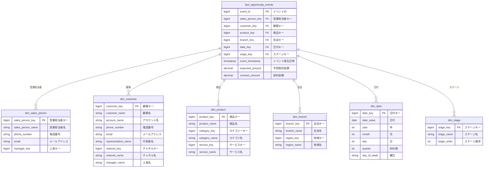

# スタースキーマ設計書

## 概要

このドキュメントは、BEAM*テーブル（`beam_opportunity_events`）をスタースキーマに変換したデータモデルの設計書です。

## データモデル図

## テーブル設計

### 1. ファクトテーブル

#### fact_opportunity_events（営業イベントファクトテーブル）

営業プロセスの各ステージでのイベントを記録するファクトテーブルです。

| カラム名 | データ型 | NULL | 主キー | 外部キー | 説明 |
|---------|---------|------|--------|---------|------|
| event_id | BIGINT | NO | ✓ | - | イベントID（主キー） |
| sales_person_key | BIGINT | NO | - | ✓ | 営業担当者キー（dim_sales_person参照） |
| customer_key | BIGINT | NO | - | ✓ | 顧客キー（dim_customer参照） |
| product_key | BIGINT | NO | - | ✓ | 商品キー（dim_product参照） |
| branch_key | BIGINT | NO | - | ✓ | 支店キー（dim_branch参照） |
| date_key | BIGINT | NO | - | ✓ | 日付キー（dim_date参照） |
| stage_key | BIGINT | NO | - | ✓ | ステージキー（dim_stage参照） |
| event_timestamp | TIMESTAMP | NO | - | - | イベント発生日時 |
| expected_amount | DECIMAL(15,2) | YES | - | - | 予想契約金額 |
| contract_amount | DECIMAL(15,2) | YES | - | - | 契約金額（成約時のみ） |

**説明：**
- トランザクションファクトテーブルとして設計されています
- 各ステージ遷移イベントが1行として記録されます
- 一度記録されたら更新されない（イミュータブル）設計です

### 2. ディメンションテーブル

#### dim_sales_person（営業担当者ディメンション）

| カラム名 | データ型 | NULL | 主キー | 説明 |
|---------|---------|------|--------|------|
| sales_person_key | BIGINT | NO | ✓ | 営業担当者キー（主キー） |
| sales_person_name | VARCHAR(100) | NO | - | 営業担当者名 |
| phone_number | VARCHAR(20) | YES | - | 電話番号 |
| email | VARCHAR(200) | YES | - | メールアドレス |
| manager_key | BIGINT | YES | - | 上長キー |

**説明：**
- 営業担当者のマスターデータを管理します
- 適合ディメンションとして、他のファクトテーブルでも使用可能です
- 上長キーは保持しますが、自己参照は行いません

#### dim_customer（顧客ディメンション）

| カラム名 | データ型 | NULL | 主キー | 説明 |
|---------|---------|------|--------|------|
| customer_key | BIGINT | NO | ✓ | 顧客キー（主キー） |
| customer_name | VARCHAR(200) | NO | - | 顧客名 |
| account_name | VARCHAR(200) | YES | - | アカウント名 |
| phone_number | VARCHAR(20) | YES | - | 電話番号 |
| email | VARCHAR(200) | YES | - | メールアドレス |
| representative_name | VARCHAR(100) | YES | - | 代表者名 |
| channel_key | BIGINT | YES | - | チャネルキー |
| channel_name | VARCHAR(100) | YES | - | チャネル名 |
| manager_name | VARCHAR(100) | YES | - | 上長名 |

**説明：**
- 顧客とアカウントのマスターデータを管理します
- チャネルディメンションを統合し、顧客ごとのチャネル情報を保持します
- 上長名を保持します
- 適合ディメンションとして、他のファクトテーブルでも使用可能です

#### dim_product（商品ディメンション）

| カラム名 | データ型 | NULL | 主キー | 説明 |
|---------|---------|------|--------|------|
| product_key | BIGINT | NO | ✓ | 商品キー（主キー） |
| product_name | VARCHAR(200) | NO | - | 商品名 |
| category_key | BIGINT | YES | - | カテゴリーキー |
| category_name | VARCHAR(100) | YES | - | カテゴリ名 |
| service_key | BIGINT | YES | - | サービスキー |
| service_name | VARCHAR(200) | YES | - | サービス名 |

**説明：**
- 商品のマスターデータを管理します
- サービスディメンションを統合し、商品ごとのサービス情報を保持します
- カテゴリー情報も含まれます
- 適合ディメンションとして、他のファクトテーブルでも使用可能です

#### dim_branch（支店ディメンション）

| カラム名 | データ型 | NULL | 主キー | 説明 |
|---------|---------|------|--------|------|
| branch_key | BIGINT | NO | ✓ | 支店キー（主キー） |
| branch_name | VARCHAR(100) | NO | - | 支店名 |
| region_key | BIGINT | YES | - | 地域キー |
| region_name | VARCHAR(100) | YES | - | 地域名 |

**説明：**
- 支店のマスターデータを管理します
- 地域ディメンションを統合し、支店ごとの地域情報を保持します
- 地域キーと地域名は保持しますが、自己参照は行いません

#### dim_date（日付ディメンション）

| カラム名 | データ型 | NULL | 主キー | 説明 |
|---------|---------|------|--------|------|
| date_key | BIGINT | NO | ✓ | 日付キー（主キー、YYYYMMDD形式） |
| date_value | DATE | NO | - | 日付 |
| year | INT | NO | - | 年 |
| month | INT | NO | - | 月 |
| day | INT | NO | - | 日 |
| quarter | INT | NO | - | 四半期（1-4） |
| day_of_week | VARCHAR(10) | NO | - | 曜日 |

**説明：**
- 日付のマスターデータを管理します
- 適合ディメンションとして、ほぼすべてのファクトテーブルで使用されます
- 日付キーはYYYYMMDD形式の整数（例：20240105）を使用します

#### dim_stage（ステージディメンション）

| カラム名 | データ型 | NULL | 主キー | 説明 |
|---------|---------|------|--------|------|
| stage_key | BIGINT | NO | ✓ | ステージキー（主キー） |
| stage_name | VARCHAR(50) | NO | - | ステージ名 |
| stage_order | INT | NO | - | ステージ順序（1-8） |

**説明：**
- 営業プロセスのステージのマスターデータを管理します
- ステージ順序により、ファネル分析での並び順を制御します
